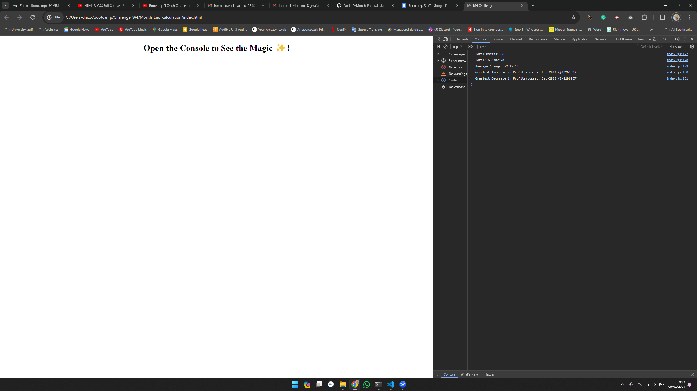

# Month_End_calculation Overview: Task to create code for analyzing the financial records of a company.

# Task completed 1: added data set to the project.
# Task completed 2: created a function to calculate the total net profit for the month.
# Task completed 3: created a function to calculate the average change in net profit for the month.
# Task completed 4: created a function to calculate the greatest increase in profits (date and amount) over the entire period.
# Task completed 5: created a function to calculate the greatest decrease in losses (date and amount) over the entire period.
# Task completed 6: created a function to calculate the total number of months included in the dataset.
# Task completed 7: created a function to calculate the total number of profitable months.
# Task completed 8: created a function to print the analysis to the terminal and export a text file with the results.

# Uploaded to Git Repository.

* Printscreen:  

#Thanks a lot, have a great day, even if the task is a week late!